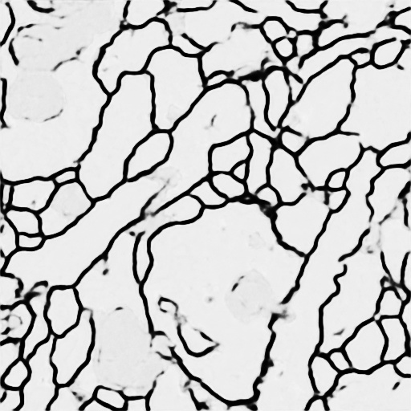
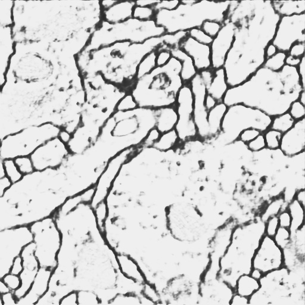

# UNet_KANConv
We tried to use the recently popular KAN convolution in UNet to further explore the possibility of KAN replacing traditional convolutional neural networks. In our preliminary experiments,we directly replaced the traditional convolution in UNet with KANConv without changing the network structure, including the size of the feature map and the number of channels, but soon encountered failure because a large number of KANConv had parameter explosion problems that made it impossible to train. We proposed a Bottleneck KANConv structure that can greatly alleviate the problem of KANConv parameter explosion, allowing UNet to be trained normally and obtain good results.

## UNet with Common Conv
In the Unet-pytorch folder, there is the traditional convolutional neural network implementation UNet. As you know, UNet uses an encoder-decoder architecture, where alternating convolutions and downsampling are applied in the encoder, and for the decoder, we use upsampling instead of transposed convolutions.

  

## UNet with Bottleneck KANConv
In the Unet-kan-pytorch folder, we use KANConv to replace traditional convolution to implement the UNet network. But we soon encountered a problem. If we directly use KANConv to replace traditional convolution, our GPU will explode before training starts. To solve this problem, we replace the two convolution layers in each convolution block of UNet with a bottleneck KANConv. The bottleneck KANConv is shown in the figure below. First, a 1×1 convolution is used to compress the number of feature map channels from in_channels to 3, then KANConv is applied while the size and number of channels of the feature map remain unchanged, and finally a 1×1 convolution is used to expand the number of feature map channels from 3 to out_channels. This greatly reduces the number of model parameters and speeds up training and inference time. In our experiments, the performance is only a few points lower than that of UNet with traditional convolution. Although it shows that KANConv still has a lot of room for improvement, it also proves the feasibility of KANConv on UNet and other similar network architectures.

  

## Comparison of Experimental Results
We conducted comparative experiments on the ISBI dataset (the dataset is available [here](https://drive.google.com/file/d/1iSD1zHDtccaomxx0RX11sx4Hrl1E_Hy6/view?usp=sharing)), training the UNet based on traditional convolution and the UNet based on Bottleneck KANConv for 50 epochs respectively.We used the Dice coefficient as the evaluation criterion. After 50 epochs of training, the Dice coefficients of the two UNets are shown in the following table.

|     | UNet with Common Conv | UNet with Bottleneck KANConv |
| :---: | :---: | :---: |
| Dice Coefficient | 88.89% |  85.06%  |

Although it has three to four fewer points than the traditional convolutional UNet, we think that UNet with Bottleneck KANConv has achieved quite good results, and we will make more improvements to it in the future.Below we compare several pictures to visualize the segmentation results of our UNet.

#### UNet with Common Conv with ReLU
  
 

#### UNet with Bottleneck KANConv without ReLU
    

## Acknowledgements
Our repository uses KANConv from [here](https://github.com/StarostinV/convkan) and is inspired by these repositories ([pykan](https://github.com/KindXiaoming/pykan),[efficient-kan](https://github.com/Blealtan/efficient-kan),[Convolutional-KANs](https://github.com/AntonioTepsich/Convolutional-KANs),[torch-conv-kan](https://github.com/IvanDrokin/torch-conv-kan)). We would like to express our gratitude for their open research and cutting-edge exploration.

